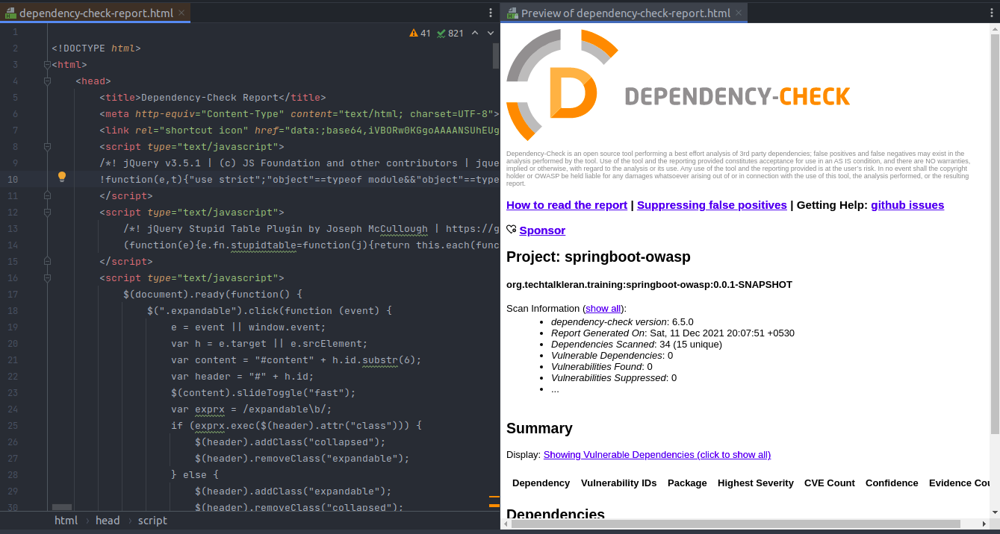

# SpringBoot OWASP

Demonstrate the capabilities of integrating owasp dependency check with local nvd database copy.

## Features

* Local NVD copy
* OWASP Integration


## Usage

Spin up a database in local. I use mariadb. You can use official docker images to set it up very quickly.

```shell
sudo docker run --detach --name maria-db --env MARIADB_USER={user} --env MARIADB_PASSWORD={password} --env MARIADB_ROOT_PASSWORD={root-password} mariadb:latest

```

Follow this [blog](https://github.com/jeremylong/DependencyCheck/blob/main/core/src/main/resources/data/initialize_mysql.sql) instruction to set up your local NVD database.


Build a lightweight SpringBoot application from [spring starter](https://start.spring.io/) or you could clone this repo.

Add the OWASP plugin to your pom file.

```xml
	<plugin>
    <groupId>org.owasp</groupId>
    <artifactId>dependency-check-maven</artifactId>
    <version>6.5.0</version>
    <executions>
        <execution>
            <goals>
                <goal>check</goal>
                <goal>update-only</goal>
            </goals>
        </execution>
    </executions>
    <dependencies>
        <dependency>
            <groupId>org.mariadb.jdbc</groupId>
            <artifactId>mariadb-java-client</artifactId>
            <version>1.4.6</version>
        </dependency>
    </dependencies>
    <configuration>
        <databaseDriverName>org.mariadb.jdbc.Driver</databaseDriverName>
        <connectionString>jdbc:mariadb://localhost:3306/dependencycheck</connectionString>
        <databaseUser>root</databaseUser>
        <databasePassword>admin</databasePassword>
    </configuration>
</plugin>
```

mvn clean install will take a bit longer initially to clone the NVD database to your local database.

Once scan is done, you will see results published under target/dependency-check-report.html



## Note

Feel free to reach out the writer <vipinev9@gmail.com> for any queries.
